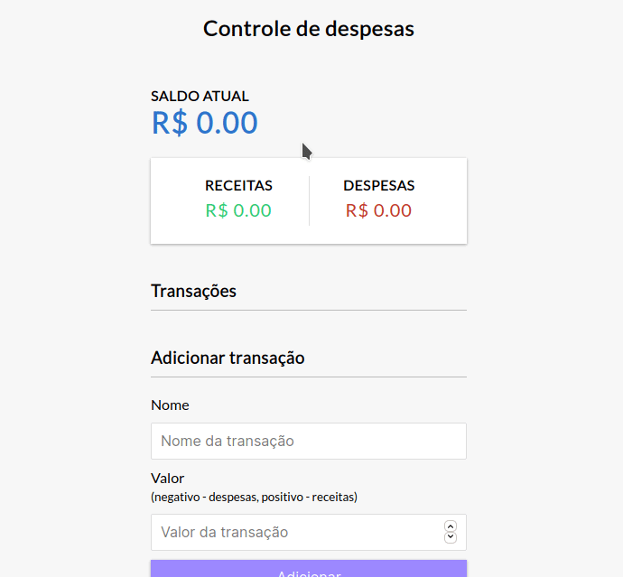

# Controle de finansa$

## 🎥 Demonstration

    

## 💻 Techs

* [] HTML
* [] CSS
* [] JavaScript

## 💡 Goals

Esta aplicação tem por objetivo praticar fundamentos JavaScript, atrás de um sistema que calcula os valores recebidos no formulário.

## 👨‍💻 Developer

**Josmar Junior**
**https://www.linkedin.com/in/josmar-junior-2ab137204**

